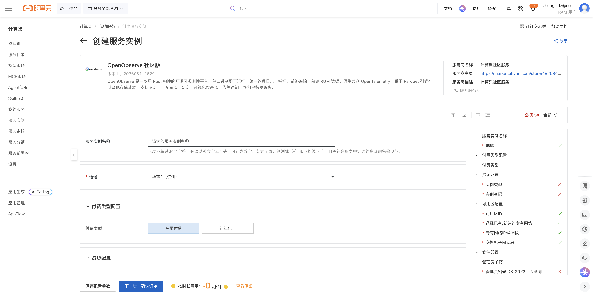
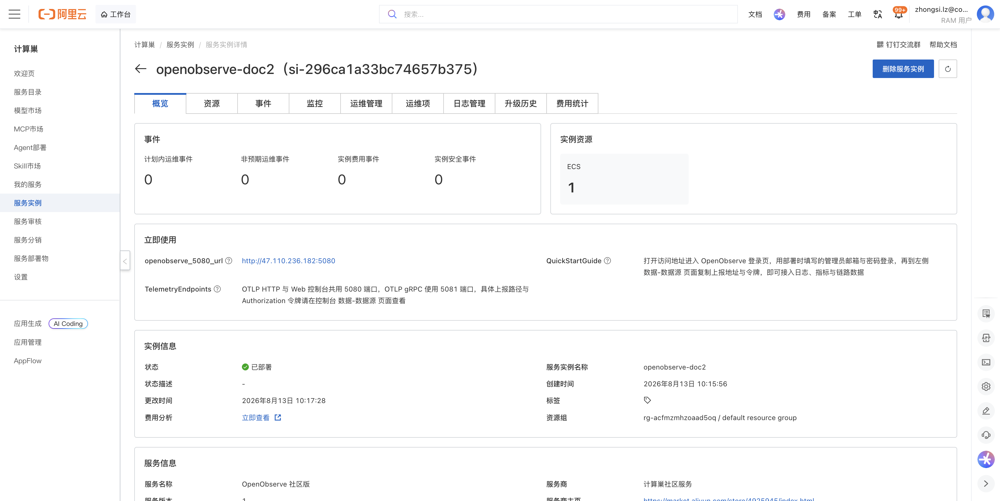
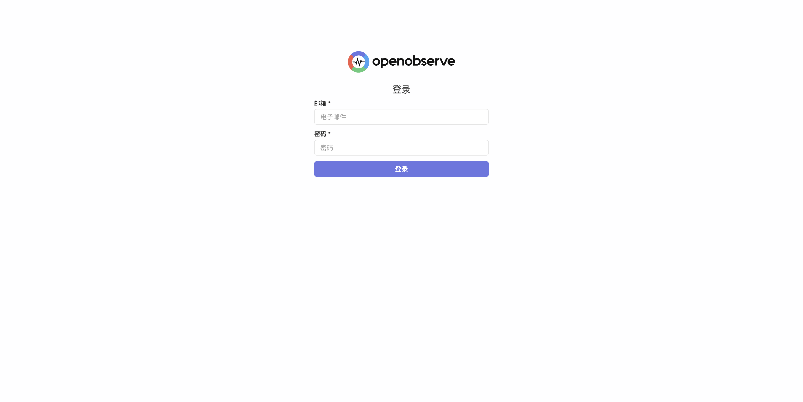
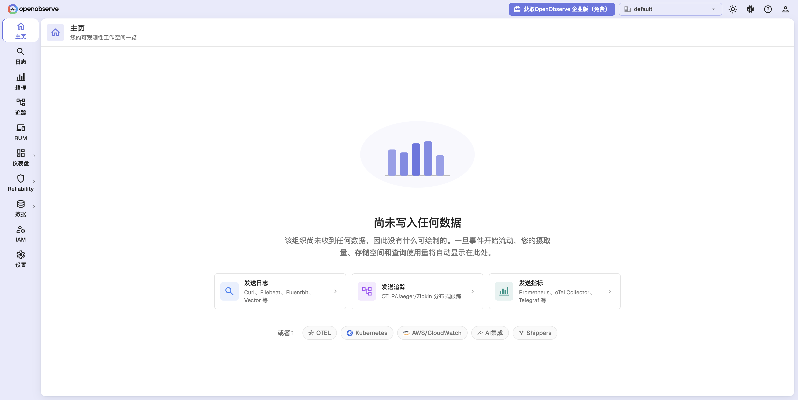
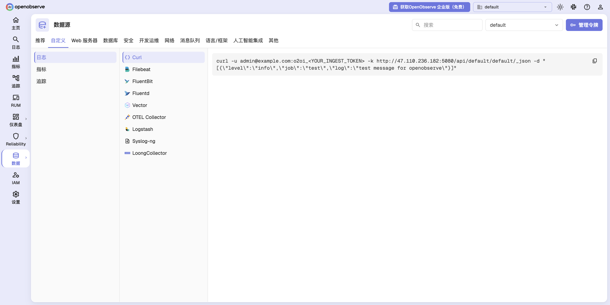
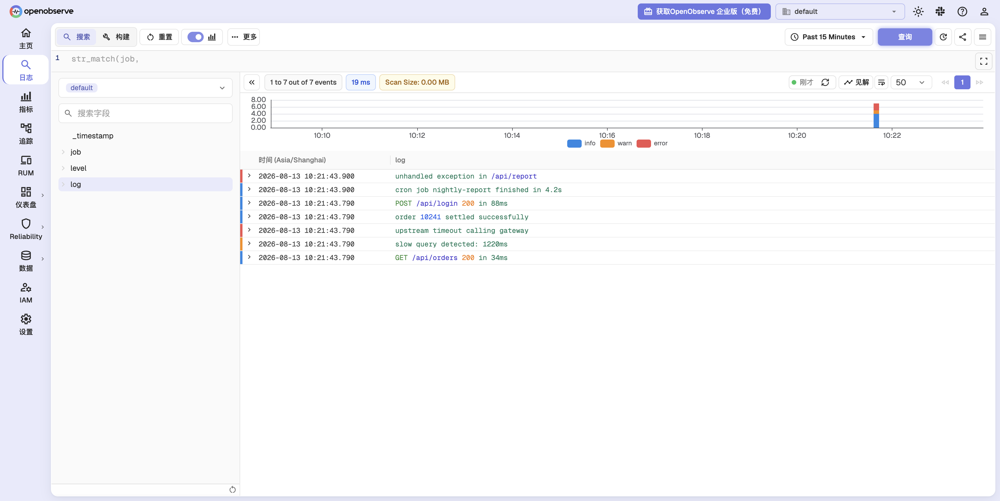

# OpenObserve 社区版 部署文档

## 概述

OpenObserve 社区版 是一款用 Rust 构建的开源可观测性平台，单二进制即可运行，统一管理日志、指标、链路追踪与前端 RUM 数据。原生兼容 OpenTelemetry，采用 Parquet 列式存储降低存储成本，支持 SQL 与 PromQL 查询、可视化仪表盘、告警通知与多租户数据隔离。通过阿里云计算巢服务，您可以快速部署 OpenObserve 社区版，实现开箱即用。

## 部署流程

### 1. 创建服务实例

访问 OpenObserve 社区版 服务部署链接，按提示填写部署参数：

[部署链接](https://computenest.console.aliyun.com/service/instance/create/cn-hangzhou?type=user&ServiceId=service-65783222efa542d5be9b)



需要填写的主要参数包括：

| 参数 | 说明 |
| --- | --- |
| 实例类型 | 建议选择 2 vCPU / 8 GiB 及以上规格（如 `ecs.u1-c1m4.large`） |
| 实例密码 | ECS 服务器登录密码，长度 8-30 位 |
| 可用区 / 专有网络 | 保持默认即可，将自动新建 VPC 与交换机 |
| 管理员邮箱 | OpenObserve 控制台的登录账号，默认 `admin@example.com` |
| 管理员密码 | OpenObserve 控制台的登录密码，8-30 位，须同时包含小写字母、大写字母、数字和特殊字符 |

> 管理员邮箱与管理员密码即为登录 OpenObserve 控制台的凭据，请妥善保存。

### 2. 确认订单并创建

参数填写完成后可以看到对应询价明细，确认参数后点击 **下一步：确认订单**。确认订单完成后同意服务协议并点击 **立即创建** 进入部署阶段。

### 3. 等待部署完成

等待部署完成后进入服务实例管理，在控制台找到 OpenObserve 社区版 访问链接。实例详情页的 **立即使用** 模块中会展示 `openobserve_5080_url` 访问地址，以及数据接入端口说明（OTLP HTTP 与 Web 控制台共用 5080 端口，OTLP gRPC 使用 5081 端口）。



### 4. 登录服务

单击 `openobserve_5080_url` 链接访问服务，进入 OpenObserve 登录页。



输入部署时填写的**管理员邮箱**与**管理员密码**，点击 **登录** 即可进入 OpenObserve 控制台首页。首次登录时尚无数据写入，页面会引导您接入第一个数据源。



## 数据接入

### 1. 获取上报地址与令牌

在左侧导航栏选择 **数据 → 数据源**，切换到 **自定义** 页签，即可按数据类型（日志 / 指标 / 追踪）和采集器类型（Curl、Filebeat、FluentBit、Fluentd、Vector、OTEL Collector、Logstash 等）查看对应的上报地址与接入示例。页面右上角的 **管理令牌** 可查看和轮换接入令牌。



以 **日志 → Curl** 为例，复制页面中的命令即可完成一次日志上报（将令牌替换为您自己实例的值）：

```bash
curl -u admin@example.com:<YOUR_INGEST_TOKEN> -k \
  http://<实例公网IP>:5080/api/default/default/_json \
  -d '[{"level":"info","job":"web-api","log":"GET /api/orders 200 in 34ms"}]'
```

上报成功后会返回如下结果：

```json
{"code":200,"status":[{"name":"default","successful":1,"failed":0}]}
```

### 2. 查询与检索日志

数据到达后会自动创建数据流。在左侧导航栏选择 **日志**，选择数据流 `default` 并点击 **查询**，即可看到上报的日志事件、按日志级别着色的时间直方图，以及左侧自动识别出的字段（`job`、`level`、`log`）。您可以进一步使用过滤条件、SQL 模式和 VRL 函数细化查询结果。



## 官方文档

更多信息请访问官方文档：[OpenObserve 官方文档](https://openobserve.ai/docs/)
